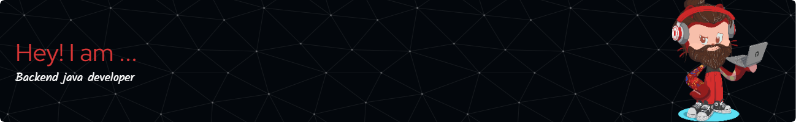

  <ul align="center" style="list-style: none">
    

      <h1>
        Hey, my name is Matt Smith 
      </h1>
    

  </ul>

**<h3 align="left">Connect with me:</h3>** 

 **<h3 align="left">🚀 Passionate backend developer, creating robust and scalable services to solve problems, and finding new tools to do so!</h3>**

**<h3 align="left">Rapid Fire</h3>**

- 💼 I'm currently working on: **💻 Developing a Community Casino**
- 🌱 I'm currently learning: **📚 New ways to create frontends with HTMX**
- 💬 Ask me about: **💡 Java, Spring, Cryptographical number generation and RESTful APIs**
- ⚡ Fun fact: **🎮 I taught myself to program to make tools to help me play games**

 **<h3 align="center">Skills</h3>**

            

 **<h3 align="left">GitHub Stats</h3>**

  
  

